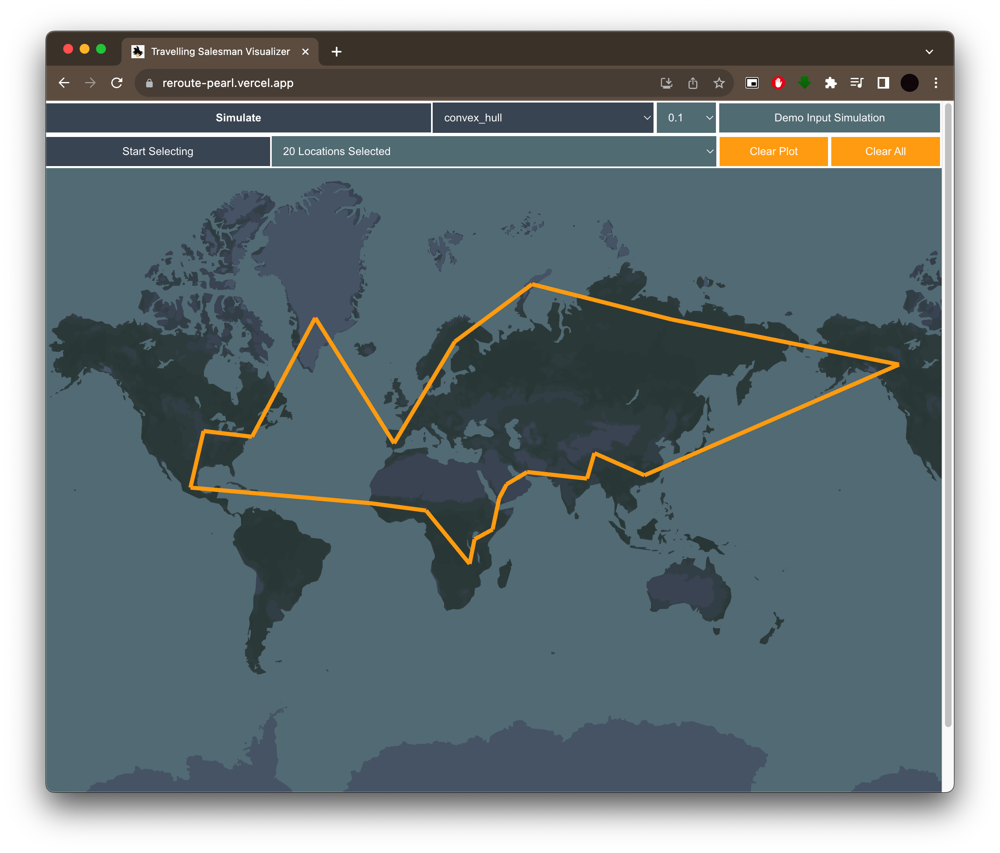

# ReRoute
Optimal Delivery Route System - Adding a little smartness to your next delivery campaign.

This project is a simulation of finding the optimal delivery path across nodes using Travelling Salesman Problem Algorithms. We get to see all the different ways of finding the optimal economic path across a set of given nodes in this visualization.

In the project directory, you can run:

### `npm start`

Final Output:

Live [here](https://reroute-pearl.vercel.app/)
